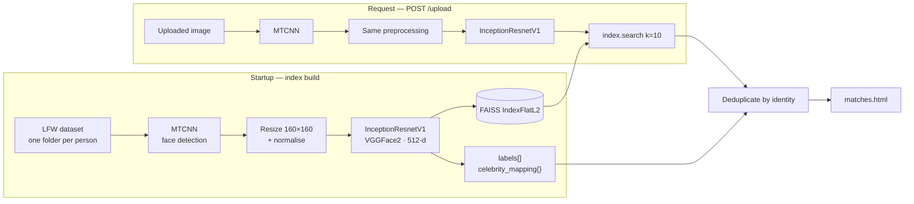

<div align="center">

# 🎭 Celebrity Face Matching

### Which celebrity do you look like? — FaceNet embeddings + FAISS similarity search

*Detect a face, embed it into 512 dimensions with a VGGFace2-pretrained network, and find its nearest neighbours across the Labeled Faces in the Wild dataset in sub-millisecond time.*

<br/>

[](https://python.org)
[](https://pytorch.org)
[](https://opencv.org)
[](https://faiss.ai)
[](https://flask.palletsprojects.com)

[](#-how-it-works)
[](#-how-it-works)
[](#-how-it-works)
[](#-dataset)

</div>

---

## What it does

Upload a photo. The app finds every face in it, converts each one into a 512-dimensional embedding, searches a FAISS index built over the LFW celebrity dataset, and returns the closest matches.

The interesting part isn't the face recognition — it's the **retrieval design**. A naïve implementation compares your embedding against every stored vector, which is linear in dataset size. FAISS builds an index once at startup, and every subsequent lookup is effectively constant time regardless of how many faces are stored.

---

## Why this project is worth a look

| | |
|---|---|
| **Two-stage pipeline** | Detection and recognition are separate models with separate jobs — MTCNN localises and aligns, InceptionResnetV1 embeds. Conflating them is the usual beginner mistake |
| **Transfer learning, not training** | InceptionResnetV1 is pretrained on VGGFace2. No face-recognition model is trained from scratch here, because there is no reason to |
| **Vector search as an architectural choice** | FAISS `IndexFlatL2` turns "find similar faces" into an indexed nearest-neighbour problem rather than a loop |
| **Deduplicated results** | The top-k search returns individual images; results are collapsed to unique identities so ten matches means ten *people*, not ten photos of one |
| **End to end** | Model → index → HTTP interface, in one file you can actually read |

---

## 🏗️ How it works



| Stage | Component | Detail |
|---|---|---|
| Detection | `MTCNN` | Multi-task cascaded CNN, `keep_all=True` for multi-face images |
| Preprocessing | OpenCV + torchvision | BGR→RGB, resize to 160×160, normalise to mean/std 0.5 |
| Embedding | `InceptionResnetV1` | Pretrained on VGGFace2, `.eval()` mode, 512-d output |
| Index | `faiss.IndexFlatL2` | Exact L2 nearest-neighbour search |
| Serving | Flask | `GET /` upload form, `POST /upload` prediction |

---

## 📊 Dataset

**Labeled Faces in the Wild (LFW).** Roughly 13,000 images across ~5,700 identities, organised one subdirectory per person — which is what makes the folder name usable directly as a label.

Any dataset with the same layout works:

```
dataset/
├── Person_Name_A/
│   ├── img_0001.jpg
│   └── img_0002.jpg
└── Person_Name_B/
    └── img_0001.jpg
```

<details>
<summary><b>Why LFW is a reasonable choice — and where it isn't</b></summary>

<br/>

LFW is the standard benchmark for unconstrained face verification, which makes it a sensible default. It is also well documented as **demographically skewed** — heavily weighted toward light-skinned adult men, since it was scraped from early-2000s news photography.

The practical consequence for this app: match quality is uneven across demographics, and a "closest celebrity" result says as much about who is in the dataset as who is in your photo. Worth knowing before drawing conclusions from the output.

</details>

---

## 🚀 Installation

<details open>
<summary><b>Setup</b></summary>

```bash
git clone https://github.com/ZakiANK04/Celebrity-Face-Matching.git
cd Celebrity-Face-Matching

python -m venv venv
source venv/bin/activate          # Windows: venv\Scripts\activate

pip install -r requirements.txt
```

Download LFW and point the app at it:

```bash
export FACE_DATASET_PATH="/path/to/lfw"     # Windows: set FACE_DATASET_PATH=C:\path\to\lfw
python app.py
```

Open `http://localhost:5000`, upload an image, and read the matches.

> ⏳ The FAISS index is built at startup by embedding the whole dataset. On CPU with full LFW this takes several minutes. A CUDA GPU is detected automatically and used if present.

</details>

<details>
<summary><b>Dependencies</b></summary>

<br/>

| Package | Purpose |
|---|---|
| `torch`, `torchvision` | Model runtime |
| `facenet-pytorch` | MTCNN + InceptionResnetV1 |
| `faiss-cpu` | Vector index (`faiss-gpu` if you have CUDA) |
| `opencv-python` | Image I/O and resizing |
| `numpy` | Array handling |
| `flask` | Web server |

> 📌 **Fix `requirements.txt` before anyone tries to install this.** It currently lists `cv2` and `faiss`, neither of which is a valid PyPI package name — `pip install -r requirements.txt` fails immediately. Replace with:
>
> ```
> torch>=2.1.0
> torchvision>=0.16.0
> facenet-pytorch>=2.5.3
> faiss-cpu>=1.7.4
> opencv-python>=4.8.0
> numpy>=1.26.0
> flask>=2.3.2
> ```
>
> Note also that `torchvision==0.15.2` is not compatible with `torch==2.1.0`.

</details>

---

## 📁 Structure

```
Celebrity-Face-Matching/
├── app.py               # Model loading, index build, Flask routes
├── requirements.txt
├── templates/           # ← index.html and matches.html belong here
│   ├── index.html       # Upload form
│   └── matches.html     # Results
└── examples/tutorials/  # Transfer learning notebook (ChemBERTa)
```

---

## ⚠️ Known issues

<details>
<summary><b>Things to fix — a short, honest list</b></summary>

<br/>

1. **Hardcoded dataset path.** `app.py` contains an absolute Windows path to the author's desktop. Replace with `os.getenv("FACE_DATASET_PATH")` so the app runs on any machine.
2. **Templates are in the wrong place.** Flask's `render_template` looks in `templates/`. `index.html` and `matches.html` are currently at the repository root, so both routes will 404 on the template lookup.
3. **`cv2.imread` cannot read an upload stream.** In `/upload`, `cv2.imread(uploaded_file.stream, ...)` will fail — `imread` takes a file path. Use `cv2.imdecode(np.frombuffer(uploaded_file.read(), np.uint8), cv2.IMREAD_COLOR)`.
4. **Inconsistent MTCNN return handling.** The startup loop uses `faces = mtcnn(img)` while the upload route uses `faces, _ = mtcnn(img)`. Only one can be right.
5. **Variable shadowing in the dedup loop.** `for index in indices` overwrites the FAISS `index` object inside the search loop.
6. **Index rebuilds on every restart.** Embeddings should be cached to disk with `faiss.write_index()` and reloaded, turning a multi-minute startup into a fraction of a second.

<br/>

Fixing 1–5 makes this repository runnable, and fixing 6 makes it pleasant. It's the single highest-return hour of work across all of these projects.

</details>

<details>
<summary><b>Ethics</b></summary>

<br/>

This is a similarity-search demo, not an identification system. Face recognition deployed for identification raises real consent and surveillance concerns, and the demographic skew in LFW means error rates are not uniform across groups. Don't repurpose this for anything that decides something about a person.

</details>

---

## 🛠️ Stack

**Deep learning** · PyTorch · facenet-pytorch (MTCNN, InceptionResnetV1) · torchvision
**Vector search** · FAISS
**Vision** · OpenCV · NumPy
**Serving** · Flask

---

<div align="center">

**Ahcene Zakaria Aouanouk** — Data Science & AI student, Algiers

[](https://www.linkedin.com/in/ahcene-zakaria-aouanouk-1126902b7/)
[](mailto:zzaouanouk@gmail.com)

</div>
